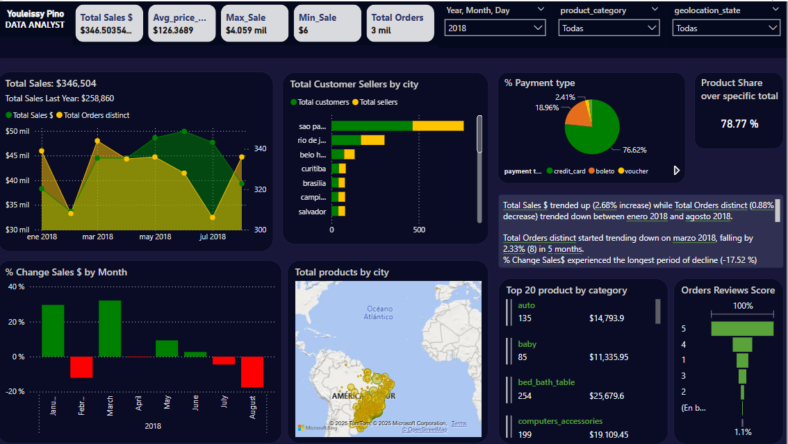

# Project: Ecommerce Olist

## Description

This was the final project of business Intelligence diploma. I loaded and transformed the data with pentaho and the final tables were allocate in PostgreSQL.

Then, I connect this tables with PowerBI, to make a dashborad as a part of solution for a unreal business problem.
This dataset is a part from Brazilian ecommerce. there is nine tables : 
customer
geolocation
seller 
payments
products
category name (english and portuguese)
order (orders items, orders, orders payment)

The final goal was visualize sale performace by  amount, time, category and other features related to this.

Dataset are from kaggle: https://www.kaggle.com/datasets/olistbr/brazilian-ecommerce

